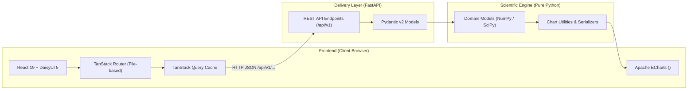
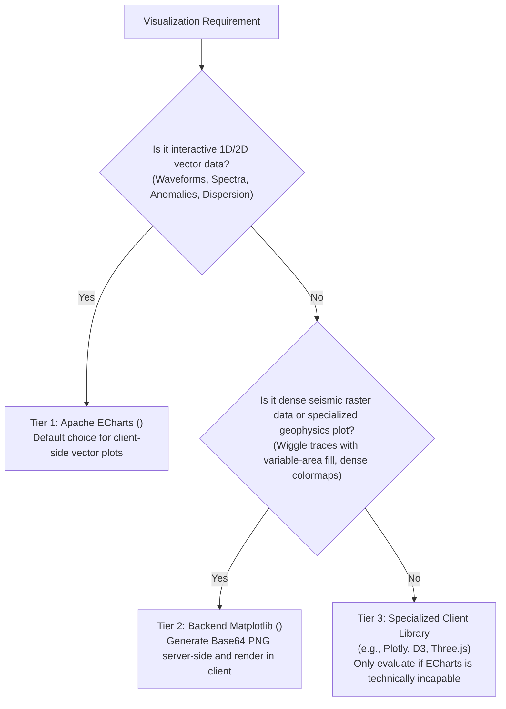

# Project Rules & Development Guidelines — Geophysics Sandbox

> **File:** `.agents/rules/GEMINI.md`  
> **Audience:** AI Coding Assistants (Gemini Code Assist, Antigravity, Claude, etc.) and Human Contributors  
> **Repository:** `geophysics-sandbox`

This document defines the authoritative architecture, coding standards, technology stack rules, and developer preferences for the **Geophysics Sandbox** project. All AI agents working on this codebase **MUST strictly follow** the rules, constraints, and operational patterns outlined below.

---

## 1. Project Mission & Generals

**Geophysics Sandbox** is an interactive, educational, and computational laboratory designed to explore and visualize foundational concepts in applied geophysics (seismic signal processing, wave propagation, potential fields, petrophysics, and inversion).

### Core Values
1. **Physical & Mathematical Rigor**: Mathematical formulations must strictly follow classical geophysical literature (e.g., Oz Yilmaz's *Seismic Data Analysis*, Telford's *Applied Geophysics*).
2. **60 FPS Interactive Exploration**: All simulations and visual charts must render smoothly on the client with responsive parameter controls, live updates, and zero UI stutter.
3. **Decoupled Architecture**: Pure numerical algorithms reside on the backend, completely independent of the web framework, while rich vector visualizations and state management are orchestrated on the frontend.
4. **Clean Workspace Discipline**: Tooling artifacts, locks, and package files must stay strictly inside their designated package directories (`frontend/` and `backend/`).

---

## 2. High-Level Architecture

The project adheres to a strict **3-Tier Decoupled Architecture**:



### Component Boundaries
- **Scientific Engine (`backend/app/modules/<domain>/`)**:
  - Contains pure, framework-agnostic Python functions and classes.
  - Depends **only** on numerical libraries (`numpy`, `scipy`, `matplotlib`).
  - **NEVER** import FastAPI, HTTP exceptions, or web request objects into scientific modules. They must be runnable and testable in standalone scripts or Jupyter notebooks.
- **API Delivery Layer (`backend/app/api/v1/`)**:
  - Handles routing, request parsing, Pydantic validation, error codes, and JSON response assembly.
  - Uses `app.common.chart_utils` to sanitize NumPy arrays into JSON-compliant structures (replacing `NaN` / `Infinity` with `None` or zeroes).
- **Frontend Layer (`frontend/src/`)**:
  - **Routing**: TanStack Router using file-based routing (`src/routes/`).
  - **Server State**: TanStack Query (`@tanstack/react-query`) for fetching, caching, and background synchronization.
  - **Visualization**: Apache ECharts client-side canvas components (`src/components/charts/EChart.tsx`).

---

## 3. Technology Stack & Package Management Rules

### Frontend Stack
- **Framework**: React 19 with TypeScript in strict mode.
- **Build Tool**: Vite 8.
- **Styling**: Tailwind CSS v4 + DaisyUI v5.
- **Routing & State**: TanStack Router + TanStack Query.
- **Math Typography**: KaTeX (`katex`) for formulas in theory drawers and annotations.
- **Charts**: Apache ECharts (`echarts`).

### Backend Stack
- **Framework**: FastAPI (Python 3.12+).
- **Server**: Uvicorn.
- **Numerical Core**: NumPy 2.x, SciPy 1.15+, Matplotlib 3.10+.
- **Validation**: Pydantic v2.

---

## 4. Package Management & Root Cleanliness Rules

> [!CAUTION]
> ### STRICT PROHIBITION: Clean Root Directory
> - **NEVER** create, run, or place `package.json`, `package-lock.json`, `pnpm-lock.yaml`, or `node_modules` in the workspace root directory.
> - **NEVER** initialize Python virtual environments (`.venv`) in the root directory.
> - Every package manager command must be executed inside its specific subdirectory (`frontend/` or `backend/`).

### Command Rules & Development Shortcuts

| Subdirectory | Language / Tool | Dev Command | Test Command | Build / Lint Command |
| :--- | :--- | :--- | :--- | :--- |
| **`frontend/`** | TypeScript / pnpm | `pnpm run dev` | `pnpm test` | `pnpm run lint` & `pnpm run build` |
| **`backend/`** | Python 3.12 / uv | `pnpm run dev` *(shortcut)*<br/>or `uv run uvicorn ...` | `pnpm test` *(shortcut)*<br/>or `uv run pytest` | `uv run ruff check` |

#### Why `pnpm run dev` in `backend/`?
For developer convenience, `backend/package.json` contains:
```json
{
  "name": "geophysics-sandbox-backend",
  "private": true,
  "scripts": {
    "dev": "uv run uvicorn app.main:app --reload --port 8000",
    "start": "uv run uvicorn app.main:app --port 8000",
    "test": "uv run pytest"
  }
}
```
This enables running `pnpm run dev` consistently in both the `frontend/` and `backend/` directories to boot the respective development servers.

---

## 5. Security & Environment Variable Directives

> [!WARNING]
> ### NEVER Read Real `.env` Files
> 1. **DO NOT** read, open, parse, print, or log any `.env` file (e.g., `frontend/.env`, `backend/.env`).
> 2. **ALWAYS** read, maintain, and update the corresponding `.env.example` file (e.g., `frontend/.env.example`).
> 3. If a new configuration key is introduced, add it with documentation and a sensible default or placeholder to `.env.example`.

Example `frontend/.env.example`:
```bash
# Backend API Base URL
# - In local development: http://localhost:8000
# - Leave empty ("") if you want relative path requests handled by Vite proxy
VITE_API_BASE_URL=http://localhost:8000
```

---

## 6. Charting & Visualization Hierarchy

Visualization is central to Geophysics Sandbox. Follow this 3-tier hierarchy when implementing any chart or plot:



### Tier 1: Apache ECharts (`<EChart />`) — Default
- Use `<EChart />` (`frontend/src/components/charts/EChart.tsx`) for all standard geophysical line series, scatter plots, dual-wave superpositions, frequency foldover diagrams, and energy curves.
- Features required:
  - Responsive resizing via `ResizeObserver`.
  - Automatic light/dark theme synchronization (`dark` vs `default`).
  - Interactive tooltip with formatted physical units (e.g., `ms`, `Hz`, `dB`, `°`).

### Tier 2: Backend Matplotlib / Seaborn (`<ImageChart />`) — Fallback
- Use `<ImageChart />` (`frontend/src/components/charts/ImageChart.tsx`) when the visualization requires:
  - Seismic wiggle traces with variable area positive/negative fill.
  - Dense 2D/3D depth slices where rendering hundreds of thousands of vector elements client-side would cause frame drops.
  - Specialized Python geophysics libraries (e.g., `obspy`, `gempy`, `segyio`).

### Tier 3: Other Client Libraries — By Exception
- If an interactive requirement cannot be met by ECharts (e.g., 3D subsurface meshes or custom WebGL shaders), propose the library explicitly and obtain user consensus before installing.

---

## 7. Modularity & Code Reusability Standards

Write modular, clean, and reusable code across the entire stack:

### Backend Modularity
- **Pure Math Isolation**: Keep algorithms inside `backend/app/modules/<domain>/<module_name>.py`.
- **Reusable Chart Serialization**: Use `app.common.chart_utils.numpy_to_python` to serialize NumPy arrays cleanly for JSON transmission.
- **Single Responsibility**: Each endpoint file in `backend/app/api/v1/endpoints/` handles exactly one educational module or feature domain.

### Frontend Modularity
- **Component Hierarchy for a Module**:
  ```text
  frontend/src/components/modules/<module_name>/
  ├── <Module>Page.tsx           # Orchestrator: state, layout, cards, ECharts
  ├── <Module>TheoryDrawer.tsx   # KaTeX mathematical theory and textbook citations
  └── <Module>Controls.tsx       # Parameter sliders, presets, toggles
  ```
- **Common Components**: Place shared UI elements (e.g., `MathFormula`, `ThemeToggle`, `Navbar`, `Sidebar`, `EChart`, `ImageChart`) in `frontend/src/components/common/`, `frontend/src/components/layout/`, or `frontend/src/components/charts/`.
- **API Client Centralization**: Centralize all typed fetch requests in `frontend/src/lib/api.ts`. Do not write ad-hoc `fetch()` calls inside individual components.

---

## 8. Type Safety Mandate (#1 Priority)

Type safety is the highest priority for both frontend and backend. Zero tolerance for loose typing.

### Backend (Python + Pydantic v2)
- Every FastAPI endpoint must specify typed request and response schemas:
  ```python
  @router.post("/analyze", response_model=WaveletPhaseResponse)
  async def analyze_wavelet(payload: WaveletPhaseRequest) -> WaveletPhaseResponse:
      ...
  ```
- All scientific functions must have full type annotations for parameters and return values:
  ```python
  def generate_ricker_wavelet(
      peak_freq: float,
      dt: float,
      duration: float,
  ) -> tuple[np.ndarray, np.ndarray]:
      ...
  ```
- Use `Pydantic` models with field constraints (e.g., `ge=0.0001`, `le=500.0`, `description=...`).

### Frontend (TypeScript Strict Mode)
- **STRICT PROHIBITION**: Do not use `any`. Use explicit interfaces, unions, or `unknown` with type guards.
- All backend responses must have corresponding TypeScript interfaces in `frontend/src/lib/api.ts`:
  ```typescript
  export interface WaveletPhaseResponse {
    time_series: {
      t: number[];
      zero_phase: number[];
      min_phase: number[];
      max_phase: number[];
      rotated_phase: number[];
    };
    metrics: {
      peak_frequency_hz: number;
      rotation_angle_deg: number;
    };
  }
  ```
- Use React 19 typing conventions (`React.ReactNode`, `FC` avoidance in favor of explicit props destructuring).

---

## 9. Documentation & Code Commenting Standards

Code must be self-documenting and mathematically clear:

### Backend Docstrings & Equations
- Every scientific function must have a Python docstring specifying:
  1. Physical concept and purpose.
  2. Mathematical formula written in LaTeX format.
  3. Parameters with explicit **physical units** (e.g., $s$, $ms$, $Hz$, $m/s$, $g/cm^3$).
  4. Textbook or paper citation (e.g., Oz Yilmaz *Seismic Data Analysis* §1.1, Eq. 1.1-4).
- Example:
  ```python
  def compute_nyquist_folding(frequencies: np.ndarray, dt: float) -> tuple[float, np.ndarray]:
      """
      Calculate the Nyquist folding frequency and apparent alias frequencies.

      Formula:
          f_N = 1 / (2 * dt)
          f_alias = |f - k * f_s|  where f_s = 1 / dt and k in Z

      Args:
          frequencies: Array of true signal harmonic frequencies in Hz.
          dt: Sampling interval in seconds (e.g. 0.004 s = 4 ms).

      Returns:
          Tuple containing (f_nyquist_hz, apparent_alias_frequencies_hz).

      Reference:
          Oz Yilmaz, "Seismic Data Analysis", Section 1.1.2, Figure 1.1-3.
      """
  ```

### Frontend Documentation
- Every module must include a `*TheoryDrawer.tsx` component rendering user-facing KaTeX formulas and educational explanations.
- Complex state transitions or coordinate transformations must include explanatory inline comments.

---

## 10. Mandatory Post-Implementation Verification Protocol

> [!IMPORTANT]
> ### Automated Testing is Mandatory
> An agent **MUST NEVER** declare an implementation complete without running the automated test suite and verifying that all tests pass with zero errors.

### The 4-Step Verification Checklist
Before concluding any implementation task:

1. **Backend Tests**:
   ```powershell
   # Run from backend/ directory
   uv run pytest
   # Or using the shortcut:
   pnpm test
   ```
   *Requirement:* All unit and integration tests in `backend/tests/` must pass.

2. **Frontend Tests**:
   ```powershell
   # Run from frontend/ directory
   pnpm test
   ```
   *Requirement:* All Vitest suites in `frontend/src/test/` must pass.

3. **Frontend Linting & Type Checking**:
   ```powershell
   # Run from frontend/ directory
   pnpm run lint
   pnpm run build
   ```
   *Requirement:* `oxlint` must report 0 errors; `tsc -b` and `vite build` must compile cleanly with 0 TypeScript errors.

4. **Root Cleanliness Check**:
   ```powershell
   # In workspace root
   git status --short
   ```
   *Requirement:* Confirm no `package.json`, `pnpm-lock.yaml`, or `node_modules` were created in the root workspace folder.

---

## 11. Quick Reference: Agent DOs and DON'Ts

| Aspect | DO ✅ | DON'T ❌ |
| :--- | :--- | :--- |
| **Workspace Root** | Keep root clean; run tools inside `frontend/` or `backend/`. | **NEVER** run `pnpm init` or install npm packages in root. |
| **Environment** | Read and edit `.env.example`. | **NEVER** inspect, read, or print `.env`. |
| **Package Management** | Use `pnpm` in `frontend/`; use `uv` and `pnpm run dev` in `backend/`. | Do not mix package managers (e.g., npm or yarn). |
| **Charts** | Use Apache ECharts (`<EChart />`) for all interactive vector plots. | Do not use heavy raster renders where vector ECharts works. |
| **Math & Physics** | Decouple pure math into `backend/app/modules/`. Include units & citations. | Do not mix math logic into FastAPI endpoint handlers. |
| **Types** | Write strict Pydantic models and strict TypeScript interfaces. | **NO `any` types**. No untyped dictionaries or endpoints. |
| **Testing** | Write and execute unit tests (`pytest` & `vitest`) after every change. | Do not claim completion without running the test suite. |
| **UI Components** | Use DaisyUI v5 classes and responsive Tailwind v4 styles. | Do not write hardcoded style hacks or arbitrary color codes. |
