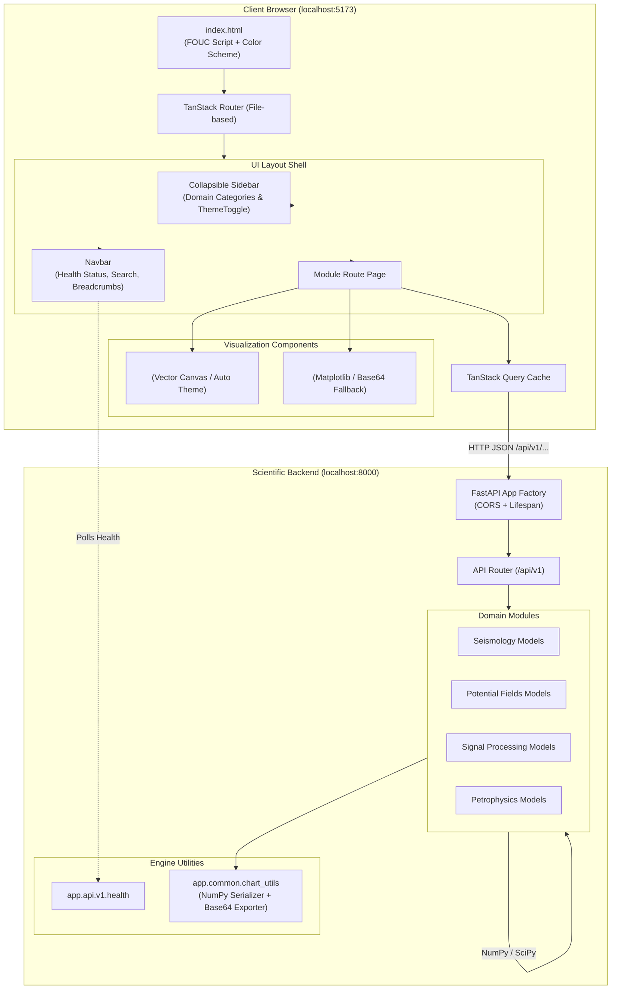
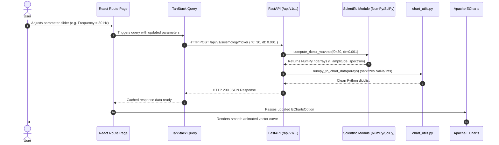
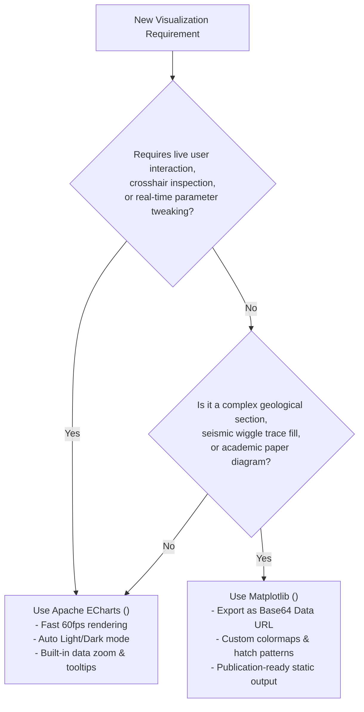

# Architecture & Developer Guide — Geophysics Sandbox

Welcome to the architectural blueprint and developer guide for **Geophysics Sandbox**. This document provides an exhaustive explanation of the application's design, data flow, component hierarchies, visualization strategies, and the exact step-by-step recipe for developing new geophysics modules.

---

## Table of Contents

1. [Architectural Philosophy](#1-architectural-philosophy)
2. [High-Level System Architecture](#2-high-level-system-architecture)
3. [Request & Data Lifecycle](#3-request--data-lifecycle)
4. [Frontend Architecture](#4-frontend-architecture)
   - [Modern Web Guidance & Theming](#modern-web-guidance--theming)
   - [Routing with TanStack Router](#routing-with-tanstack-router)
   - [Server State with TanStack Query](#server-state-with-tanstack-query)
   - [Layout & Navigation System](#layout--navigation-system)
5. [Backend Architecture](#5-backend-architecture)
   - [FastAPI Service Hierarchy](#fastapi-service-hierarchy)
   - [Scientific Numerical Stack](#scientific-numerical-stack)
   - [JSON Serialization & Array Safety](#json-serialization--array-safety)
6. [Visualization & Charting Decision Tree](#6-visualization--charting-decision-tree)
7. [Developer Recipe: Adding a New Module](#7-developer-recipe-adding-a-new-module)
8. [Testing & Quality Standards](#8-testing--quality-standards)

---

## 1. Architectural Philosophy

Geophysics Sandbox is built around four core architectural principles:

1. **Separation of Scientific Math and Delivery**:
   Mathematical formulas and physics models live as pure, framework-agnostic Python functions in `backend/app/modules/`. They do not depend on FastAPI or web concepts and can be imported directly into notebooks, scripts, or unit tests.
2. **Interactive 60fps Vector Visualization**:
   Calculations are executed on the backend using high-performance C/Fortran-accelerated libraries (NumPy, SciPy), while chart rendering is offloaded to the client via Apache ECharts for silky-smooth 60fps zooming, panning, tooltip inspection, and dynamic theme switching.
3. **Strict Modern Web Guidance Standards**:
   The frontend uses standard web platform features (CSS `color-scheme`, native `ResizeObserver`, CSS custom properties, responsive container queries) and prevents Flash of Unstyled Content (FOUC) through synchronous initialization scripts.
4. **Modular Extensibility**:
   Adding a new topic (e.g., *Ricker Wavelet*, *Gravity Anomaly of a Sphere*, *Snell's Law*) follows a predictable 3-tier convention without touching core application plumbing.

---

## 2. High-Level System Architecture



---

## 3. Request & Data Lifecycle

The following sequence demonstrates how user parameter interactions propagate from the UI to Python numerical computation and back to interactive rendering:



---

## 4. Frontend Architecture

### Modern Web Guidance & Theming
The application adheres strictly to modern web guidance standards:
- **FOUC Prevention**: In `frontend/index.html`, an inline synchronous script in `<head>` checks `localStorage` and `matchMedia('(prefers-color-scheme: dark)')` before styles render, stamping `data-theme` on `<html>`.
- **CSS Color Scheme**: `<meta name="color-scheme" content="light dark" />` tells the browser's native UI (scrollbars, form controls) which mode to render immediately.
- **DaisyUI v5.7.42 + Tailwind CSS v4**: Theme tokens cascade via CSS variables. When toggled, `ThemeToggle.tsx` updates `document.documentElement.setAttribute('data-theme', theme)` and emits a custom `window.dispatchEvent(new CustomEvent('themechange'))`.
- **ECharts Synchronization**: `<EChart />` listens to `themechange`, re-initializing the ECharts instance with the matching dark/light palette automatically.

### Routing with TanStack Router
- **File-Based Routing**: All pages live in `frontend/src/routes/`. The Vite plugin `@tanstack/router-plugin/vite` scans this folder and auto-generates `src/routeTree.gen.ts`.
- **Type Safety**: Routes, path parameters, and search query parameters are fully typed across the codebase.
- **Root Layout (`src/routes/__root.tsx`)**: Provides the persistent application shell (`AppLayout`), React Query provider, and development inspection tools.

### Server State with TanStack Query
- All backend communication is wrapped in `useQuery` or `useMutation` hooks via `queryClient.ts`.
- Responses are automatically cached with a 5-minute stale-time, preventing redundant numerical recalculations when navigating between tabs.
- API base URL is driven by `VITE_API_BASE_URL` in `.env`, falling back to `""` (which routes through Vite's local dev proxy).

### Layout & Navigation System
- `AppLayout.tsx`: Responsive flex container hosting sidebar, sticky navbar, and scrollable content area.
- `Sidebar.tsx`: Collapsible side menu displaying the 4 core geophysics domains (*Seismology*, *Potential Fields*, *Signal Processing*, *Petrophysics*), dynamic topic links, and the bottom theme toggle.
- `Navbar.tsx`: Features breadcrumbs, quick search input (`Ctrl+K`), and a live indicator polling `/api/v1/health`.

---

## 5. Backend Architecture

### FastAPI Service Hierarchy
The backend application is structured as follows:

```
backend/
├── app/
│   ├── api/
│   │   └── v1/
│   │       ├── health.py            # System health & runtime versions
│   │       ├── router.py            # Central v1 route aggregator
│   │       └── [domain]/            # Domain route endpoints
│   ├── common/
│   │   └── chart_utils.py           # NumPy JSON & Matplotlib Base64 helpers
│   ├── core/
│   │   └── config.py                # Pydantic Settings & CORS rules
│   ├── modules/                     # Pure scientific geophysics algorithms
│   │   ├── seismology/
│   │   ├── potential_fields/
│   │   ├── signal_processing/
│   │   └── petrophysics/
│   └── main.py                      # FastAPI app initialization & CORS
├── tests/                           # Pytest automated test suite
├── pyproject.toml                   # uv dependency specifications
└── package.json                     # pnpm developer shortcuts
```

### Scientific Numerical Stack
- **NumPy 2.5+**: High-performance multidimensional arrays, vector operations, FFT, matrix algebra.
- **SciPy 1.18+**: Signal filtering, numerical integration, optimization, wave propagation modeling.
- **Matplotlib 3.11+**: Scientific image generation for complex academic figures and legacy plots.

### JSON Serialization & Array Safety
Standard JSON specifications do not support IEEE floating-point `NaN`, `+Infinity`, or `-Infinity`. Geophysics calculations often produce these values (e.g. division by zero in attenuation models or critical refraction angles).

`app.common.chart_utils.numpy_to_chart_data(arr, handle_nan=None)`:
1. Converts arbitrary NumPy array dimensions (1D curves, 2D grids, 3D cubes) to native Python lists.
2. Replaces `NaN` and `Inf` with `None`, serializing cleanly to JSON `null` so frontend charts can handle gaps without crashing.

---

## 6. Visualization & Charting Decision Tree

To maintain high visual quality and interactive performance, follow this decision tree when creating visualizations:



### Summary Comparison Table

| Feature | Apache ECharts (`<EChart />`) | Matplotlib (`<ImageChart />`) |
| :--- | :--- | :--- |
| **Best For** | 1D wavelets, spectra, gravity profiles, decay curves | Complex seismic gathers, wiggle traces, geological cross-sections |
| **Rendering** | Client-side Canvas / SVG | Backend Server-side Image (PNG/SVG) |
| **Theme Sync** | Instant automatic light/dark switching | Requires re-rendering image on backend |
| **Interactivity** | Hover tooltips, zoom, pan, toggle series | Static zoom modal, download PNG button |
| **Backend Payload** | Small JSON numerical coordinates (`x`, `y`) | Base64 encoded image string |

---

## 7. Developer Recipe: Adding a New Module

Follow this exact 6-step recipe whenever you study a new geophysics topic and want to add an interactive module to the sandbox.

### Case Study: Adding *Ricker Wavelet* to Seismology

#### Step 1: Write the Scientific Algorithm
Create `backend/app/modules/seismology/ricker.py`:
```python
import numpy as np

def generate_ricker_wavelet(f0: float, length: float = 0.2, dt: float = 0.001):
    """
    Generate a zero-phase Ricker wavelet.
    f0: Peak frequency in Hz
    length: Total duration in seconds
    dt: Sample interval in seconds
    """
    t = np.arange(-length / 2, length / 2, dt)
    pi2_f0_2_t2 = (np.pi * f0 * t) ** 2
    amplitude = (1.0 - 2.0 * pi2_f0_2_t2) * np.exp(-pi2_f0_2_t2)
    return t, amplitude
```

#### Step 2: Write Backend Unit Tests
Create `backend/tests/modules/test_ricker.py`:
```python
import numpy as np
from app.modules.seismology.ricker import generate_ricker_wavelet

def test_ricker_wavelet_peak():
    t, amp = generate_ricker_wavelet(f0=25, length=0.2, dt=0.001)
    # Peak must be exactly 1.0 at t = 0
    center_idx = len(t) // 2
    assert np.isclose(amp[center_idx], 1.0, atol=1e-3)
    assert np.isclose(t[center_idx], 0.0, atol=1e-3)
```

#### Step 3: Expose the FastAPI Endpoint
Create `backend/app/api/v1/seismology/router.py`:
```python
from fastapi import APIRouter
from pydantic import BaseModel, Field
from app.modules.seismology.ricker import generate_ricker_wavelet
from app.common.chart_utils import numpy_to_chart_data

router = APIRouter()

class RickerRequest(BaseModel):
    f0: float = Field(default=25.0, ge=1.0, le=120.0, description="Peak frequency in Hz")
    length: float = Field(default=0.2, ge=0.05, le=1.0, description="Duration in seconds")
    dt: float = Field(default=0.001, ge=0.0001, le=0.005, description="Sample interval")

@router.post("/ricker")
def calculate_ricker(req: RickerRequest):
    t, amp = generate_ricker_wavelet(f0=req.f0, length=req.length, dt=req.dt)
    return {
        "time": numpy_to_chart_data(t),
        "amplitude": numpy_to_chart_data(amp),
        "peak_frequency": req.f0,
    }
```
Mount this router in `backend/app/api/v1/router.py`:
```python
from app.api.v1.seismology import router as seismology_router
api_router.include_router(seismology_router.router, prefix="/seismology", tags=["Seismology"])
```

#### Step 4: Create the Frontend Route Page
Create `frontend/src/routes/seismology/ricker.tsx`:
```tsx
import { useState } from 'react'
import { createFileRoute } from '@tanstack/react-router'
import { useQuery } from '@tanstack/react-query'
import type { EChartsOption } from 'echarts'
import { apiFetch } from '../../lib/api'
import { EChart } from '../../components/charts/EChart'

export const Route = createFileRoute('/seismology/ricker')({
  component: RickerPage,
})

function RickerPage() {
  const [f0, setF0] = useState(25)

  const { data, isLoading } = useQuery({
    queryKey: ['ricker', f0],
    queryFn: () => apiFetch<{ time: number[]; amplitude: number[] }>('/api/v1/seismology/ricker', {
      method: 'POST',
      body: JSON.stringify({ f0, length: 0.2, dt: 0.001 }),
    }),
  })

  const chartOption: EChartsOption = {
    title: { text: `Ricker Wavelet (${f0} Hz)` },
    tooltip: { trigger: 'axis' },
    xAxis: { type: 'category', data: data?.time.map((t) => t.toFixed(3)) || [] },
    yAxis: { type: 'value', name: 'Amplitude' },
    series: [{ type: 'line', data: data?.amplitude || [], smooth: true }],
  }

  return (
    <div className="space-y-6">
      <h1 className="text-xl font-bold">Ricker Wavelet Model</h1>
      <div className="card bg-base-100 p-4 border border-base-300">
        <label className="text-xs font-semibold">Peak Frequency: {f0} Hz</label>
        <input
          type="range"
          min="5"
          max="100"
          value={f0}
          onChange={(e) => setF0(Number(e.target.value))}
          className="range range-primary range-sm mt-2"
        />
      </div>
      <div className="card bg-base-100 p-4 border border-base-300">
        <EChart option={chartOption} loading={isLoading} />
      </div>
    </div>
  )
}
```

#### Step 5: Register the Topic in the Sidebar
In `frontend/src/components/layout/Sidebar.tsx`, add the route under its domain:
```tsx
{
  id: 'seismology',
  name: 'Seismology',
  icon: Waves,
  modules: [
    { id: 'ricker', title: 'Ricker Wavelet', route: '/seismology/ricker' }
  ],
}
```

#### Step 6: Verify Tests
```powershell
cd backend && pnpm test
cd ../frontend && pnpm test && pnpm build
```

---

## 8. Testing & Quality Standards

Every new feature or module must adhere to the **Full-Stack Testing Standard**:

### Backend Testing (`pytest`)
- Located in `backend/tests/`.
- Tests must verify:
  1. **Analytical Accuracy**: Check computed values against known textbook formulas (e.g. wavelet peak = 1.0, Nyquist cutoff attenuation, boundary reflection coefficients).
  2. **Boundary Conditions**: Test behavior with extreme inputs (e.g., $f_0 = 0$, $dt \to 0$, $v_1 = v_2$).
  3. **Array Sanitization**: Ensure `numpy_to_chart_data` handles division by zero or infinite values gracefully without returning invalid JSON.

### Frontend Testing (`vitest` + `@testing-library/react`)
- Located beside components (`.test.tsx`).
- Tests must verify:
  1. **DOM Container Rendering**: Chart containers mount cleanly without throwing canvas context errors.
  2. **Parameter Reactivity**: Adjusting sliders or inputs correctly invokes update handlers.
  3. **Theme Events**: Ensure theme updates propagate without memory leaks.
