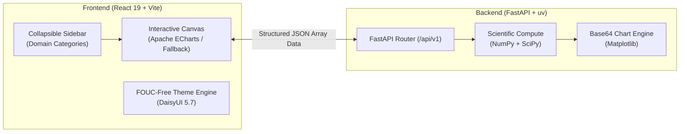

# Geophysics Sandbox 🌍⚡

[](https://react.dev/)
[](https://www.typescriptlang.org/)
[](https://daisyui.com/)
[](https://tailwindcss.com/)
[](https://fastapi.tiangolo.com/)
[](https://www.python.org/)
[](https://numpy.org/)
[](https://scipy.org/)
[](https://echarts.apache.org/)
[](LICENSE)

An interactive computational sandbox designed as a personal laboratory for learning geophysics. As I study textbooks, research papers, and industry references, this sandbox serves as the canvas where theoretical concepts are transformed into numerical algorithms and interactive visualizations.

---

## 🧭 System Overview

The sandbox is architected as a modern, decoupled full-stack application:



- **Frontend**: Built with React 19, TypeScript, Tailwind CSS v4, and DaisyUI v5.7.42. Routing is file-based via TanStack Router with TanStack Query caching.
- **Backend**: Powered by Python 3.12, FastAPI, NumPy, SciPy, and Matplotlib, managed with `uv`.
- **Visualization**: Primary plotting uses Apache ECharts for reactive, 60fps vector graphics with seamless dark/light theme switching. Complex geological and seismic gathers fall back to server-generated Matplotlib images.

For detailed architecture diagrams, request lifecycles, and module implementation recipes, see **[ARCHITECTURE.md](ARCHITECTURE.md)**.

---

## ⚡ Prerequisites

Make sure you have the following installed on your machine:
- **Node.js** >= 20.x
- **pnpm** >= 9.x (`npm install -g pnpm`)
- **Python** >= 3.12
- **uv** (Recommended Python package manager: `curl -LsSf https://astral.sh/uv/install.sh` or `pip install uv`)

---

## 🚀 Quick Start

### 1. Setup & Start the Backend (FastAPI)
```bash
cd backend

# Install dependencies (automatic with uv)
uv sync

# Run development server with hot-reload
pnpm run dev
# (or directly: uv run uvicorn app.main:app --reload --port 8000)
```
- Interactive API Swagger Docs: [http://localhost:8000/docs](http://localhost:8000/docs)
- Health Check Endpoint: [http://localhost:8000/api/v1/health](http://localhost:8000/api/v1/health)

### 2. Setup & Start the Frontend (React + Vite)
```bash
cd frontend

# Install dependencies
pnpm install

# (Optional) Copy environment template
cp .env.example .env

# Run Vite dev server
pnpm run dev
```
- Interactive Web App: [http://localhost:5173](http://localhost:5173)

---

## 🧪 Running Automated Tests

Both frontend and backend include automated test suites:

```bash
# Run backend tests (Pytest + HTTPX)
cd backend
pnpm test

# Run frontend tests (Vitest + React Testing Library)
cd frontend
pnpm test

# Run frontend production build
cd frontend
pnpm run build
```

---

## 🗺️ Geophysics Domain Roadmap

Topics planned to be built out iteratively as learning progresses:

| Domain | Topic / Module | Visualization Engine | Status |
| :--- | :--- | :--- | :---: |
| **Seismology** | Ricker & Ormsby Wavelets | Apache ECharts | Planned |
| **Seismology** | Snell's Law & Ray Tracing | Apache ECharts | Planned |
| **Seismology** | Normal Moveout (NMO) Correction | ECharts / Matplotlib | Planned |
| **Seismology** | Zoeppritz Reflection Coefficients (AVO) | Apache ECharts | Planned |
| **Potential Fields** | Gravity Anomaly of a Sphere & Cylinder | Apache ECharts | Planned |
| **Potential Fields** | Magnetic Dipole Anomalies | Apache ECharts | Planned |
| **Signal Processing** | Discrete Fourier Transform & FFT | Apache ECharts | Planned |
| **Signal Processing** | Convolution & Synthetic Seismograms | Apache ECharts | Planned |
| **Signal Processing** | Bandpass & Notch Filtering | Apache ECharts | Planned |
| **Petrophysics** | Archie's Equation (Water Saturation) | Apache ECharts | Planned |
| **Petrophysics** | Wyllie Time-Average Equation (Sonic Porosity) | Apache ECharts | Planned |

---

## 🛠️ How to Add a New Topic

To add a new geophysics topic, follow the 3-tier modular workflow:
1. **Compute**: Write pure scientific formulas in `backend/app/modules/<domain>/<topic>.py`.
2. **API**: Expose parameters and results in `backend/app/api/v1/<domain>/<topic>.py`.
3. **UI**: Create route in `frontend/src/routes/<domain>/<topic>.tsx` with parameter sliders and `<EChart />`.
4. **Register**: Add the route to `frontend/src/components/layout/Sidebar.tsx`.

See the complete step-by-step tutorial with code examples in **[ARCHITECTURE.md](ARCHITECTURE.md)**.

---

## 📄 License

Created by **Mochammad Naufal Septifiandi** @ 2026.  
Licensed under the [Apache License, Version 2.0](LICENSE).